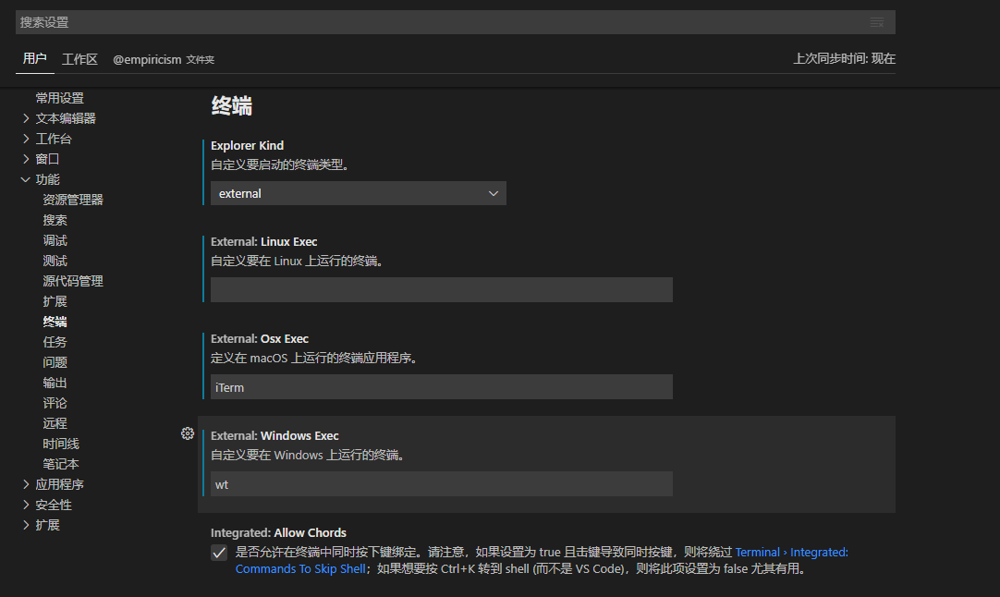

# windows_terminal_preview

vscode中windows终端设置

## 相关文章
* [Windows Terminal完整指南](https://zhuanlan.zhihu.com/p/272082726)
* [在 VS Code 中打开 Windows Terminal](https://zhuanlan.zhihu.com/p/392287986)

## 下载地址
[github最新版本链接地址](https://github.com/microsoft/terminal/releases/tag/v1.11.2921.0)